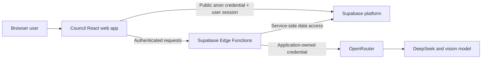
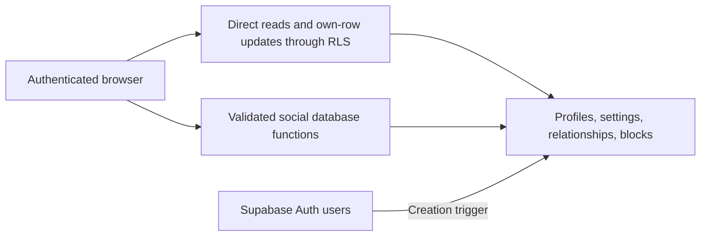
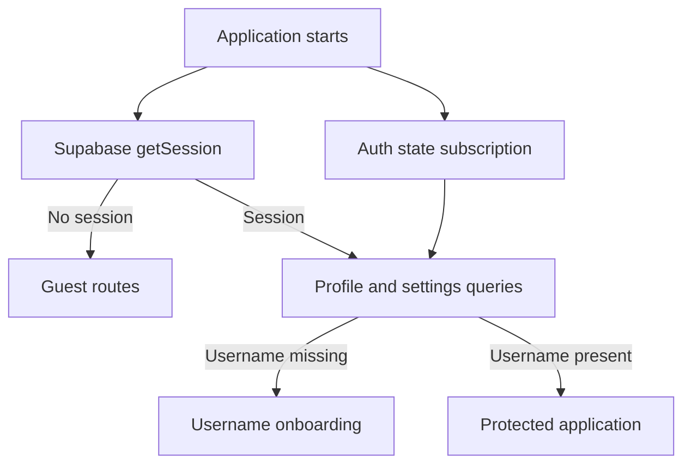

# Architecture

## System context

## Boundaries

The browser is untrusted. It receives only the public Supabase URL and anon key. Authorization
must be enforced by PostgreSQL Row Level Security and server-side functions, never by hidden UI
alone.

Supabase PostgreSQL, Auth, Realtime, Storage, and Edge Functions form Council's trusted server
boundary. Trusted infrastructure can read stored messages and media. Service-role credentials
remain inside this boundary.

OpenRouter and selected model providers are external data processors. Only content explicitly
sent or forwarded to an AI contact may cross this boundary. Application-owned credentials are
used; users do not supply provider keys.

## Planned server components

Future Edge Functions include `ai-chat`, `extract-memory`, `summarize-ai-conversation`,
`create-upload`, `create-media-url`, `process-forwarded-context`, `billing-webhook`,
`export-account`, and `delete-account`. They are architectural expectations, not Milestone 0
implementations.

## Repository architecture

- `apps/web` owns the responsive React application, routes, browser integration, and web tests.
- `packages/schemas` owns environment-neutral Zod schemas shared at runtime boundaries.
- `supabase` owns local service configuration, immutable migrations, pgTAP tests, and future Edge
  Functions.
- `docs` records locked product, architecture, security, and operational decisions.
- `tasks` retains bounded implementation specifications as project history.

The web application uses JavaScript with JSDoc where types clarify boundaries. This keeps the
locked frontend language while ESLint, runtime validation, and tests provide guardrails.
Supabase Edge Functions may use TypeScript because Deno supports it directly and server
boundaries benefit from static checking. Shared schemas remain JavaScript so both environments can
consume them without a compilation step.

## Runtime flow

TanStack Query will manage server state, Zustand manages local UI state, React Router owns
navigation, and the Supabase JavaScript SDK is created from validated browser-safe configuration.

## Account and social database boundary

The authenticated browser may directly select its own profile and settings, update explicitly
granted own-row columns, select visible participant relationships, and select blocks it created.
General stranger discovery is not a table scan: it goes through the bounded
`search_profiles` function and returns a minimal shape.

Cross-user social mutations use narrowly scoped security-definer functions. Those functions
derive the actor from `auth.uid()`, validate target and state, use a fixed
`search_path = public, pg_temp`, and serialize pair mutations with transaction-level advisory
locks. Clients cannot directly insert, update, or delete relationships or blocks.

The private helper schema is not exposed as an API schema. Authenticated users receive only the
schema/function access required for profile RLS; arbitrary-identity block/contact helpers remain
non-executable.

## Web authentication lifecycle

Supabase Auth is the only session source of truth. `AuthProvider` hydrates the existing browser
session, subscribes to Auth events, and exposes session/account states through React context.
Tokens remain inside the Supabase client and are never copied to Zustand, query data, or logs.

TanStack Query owns the current profile and settings. Queries are enabled only for authenticated
users, and profile/settings creation races receive bounded retries because rows are created by
the Auth database trigger. Profile errors remain distinct from signed-out state. Logout removes
all `account` query keys after Supabase completes the session operation.

Guest, onboarding, and protected guards wait for hydration before rendering or redirecting.
Protected redirects carry only an internal route in navigation state. Login passes that value
through a strict internal-path allowlist before navigation.

Presentational components call focused Auth and account API modules rather than using Supabase
directly. Profile changes use `set_my_profile`; preferences use `update_my_settings`, which
merges supported fields without deleting unrelated stored JSON keys.

Password recovery is marked only by Supabase's `PASSWORD_RECOVERY` event. Ordinary authenticated
sessions can reach the same password form only after an explicit security-screen action stored
temporarily in session storage.

## Contacts feature boundary

The contacts experience lives in a focused feature area under
`apps/web/src/features/contacts`: an `api` module of Supabase wrappers, `queries` for query
options and mutation hooks, presentational `components`, `pages`, `hooks`, and pure `utils`.
Presentational components never call Supabase directly; only the `api` wrappers do, and every
wrapper validates returned rows with the shared `@council/schemas` contracts before the data
reaches a component.

All cross-user social writes (sending, responding to, removing, blocking, and unblocking) go
through the existing security-definer database functions. The browser never inserts, updates, or
deletes relationship or block rows. Discovery deliberately avoids direct profile-table
enumeration: it calls the bounded `search_profiles` RPC, which requires at least two characters,
caps results, and applies privacy and block filtering server-side. The blocked-users screen uses
the dedicated `list_my_blocked_users` function because profile RLS hides blocked pairs from each
other.

TanStack Query owns all contacts server state under stable `contacts.*` query keys
(`list`, `requests`, `blocked`, and per-query `search`). Mutations invalidate exactly the buckets
the database contract can change rather than relying on optimistic updates. Only transient form
and dialog state is component-local; no contact data is duplicated into Zustand. A pending
incoming-request count is derived from the shared requests query and shown in navigation.

Supabase Realtime is intentionally deferred to a later milestone. Until then the request count and
lists refresh on tab focus, on normal stale-time expiry, and after successful mutations rather
than through live subscriptions, so a short-lived stale count is expected and acceptable.
