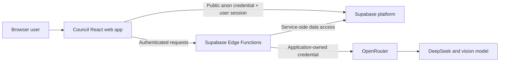
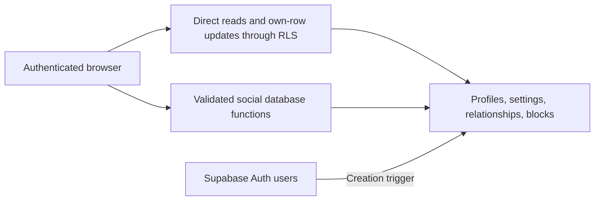

# Architecture

## System context

## Boundaries

The browser is untrusted. It receives only the public Supabase URL and anon key. Authorization
must be enforced by PostgreSQL Row Level Security and server-side functions, never by hidden UI
alone.

Supabase PostgreSQL, Auth, Realtime, Storage, and Edge Functions form Council's trusted server
boundary. Trusted infrastructure can read stored messages and media. Service-role credentials
remain inside this boundary.

OpenRouter and selected model providers are external data processors. Only content explicitly
sent or forwarded to an AI contact may cross this boundary. Application-owned credentials are
used; users do not supply provider keys.

## Planned server components

Future Edge Functions include `ai-chat`, `extract-memory`, `summarize-ai-conversation`,
`create-upload`, `create-media-url`, `process-forwarded-context`, `billing-webhook`,
`export-account`, and `delete-account`. They are architectural expectations, not Milestone 0
implementations.

## Repository architecture

- `apps/web` owns the responsive React application, routes, browser integration, and web tests.
- `packages/schemas` owns environment-neutral Zod schemas shared at runtime boundaries.
- `supabase` owns local service configuration, immutable migrations, pgTAP tests, and future Edge
  Functions.
- `docs` records locked product, architecture, security, and operational decisions.
- `tasks` retains bounded implementation specifications as project history.

The web application uses JavaScript with JSDoc where types clarify boundaries. This keeps the
locked frontend language while ESLint, runtime validation, and tests provide guardrails.
Supabase Edge Functions may use TypeScript because Deno supports it directly and server
boundaries benefit from static checking. Shared schemas remain JavaScript so both environments can
consume them without a compilation step.

## Runtime flow

TanStack Query will manage server state, Zustand manages local UI state, React Router owns
navigation, and the Supabase JavaScript SDK is created from validated browser-safe configuration.

## Account and social database boundary

The authenticated browser may directly select its own profile and settings, update explicitly
granted own-row columns, select visible participant relationships, and select blocks it created.
General stranger discovery is not a table scan: it goes through the bounded
`search_profiles` function and returns a minimal shape.

Cross-user social mutations use narrowly scoped security-definer functions. Those functions
derive the actor from `auth.uid()`, validate target and state, use a fixed
`search_path = public, pg_temp`, and serialize pair mutations with transaction-level advisory
locks. Clients cannot directly insert, update, or delete relationships or blocks.

The private helper schema is not exposed as an API schema. Authenticated users receive only the
schema/function access required for profile RLS; arbitrary-identity block/contact helpers remain
non-executable.
