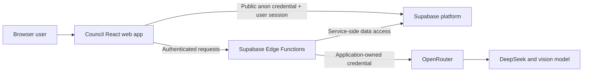
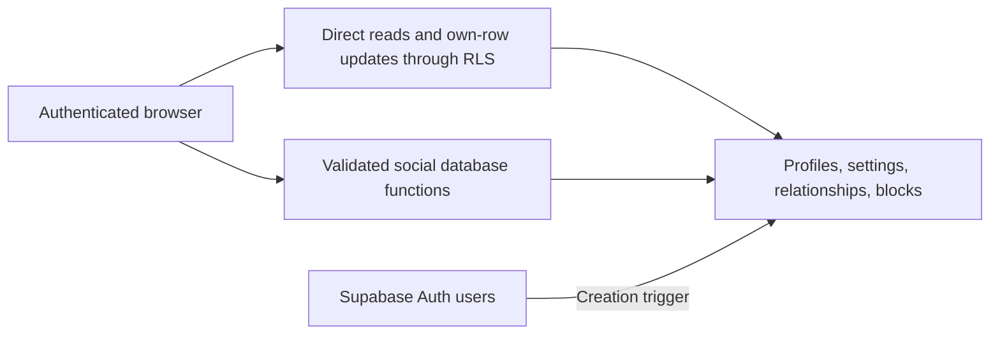
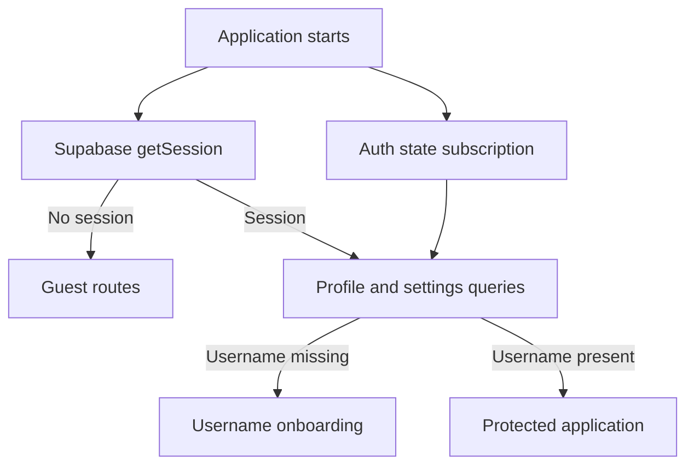
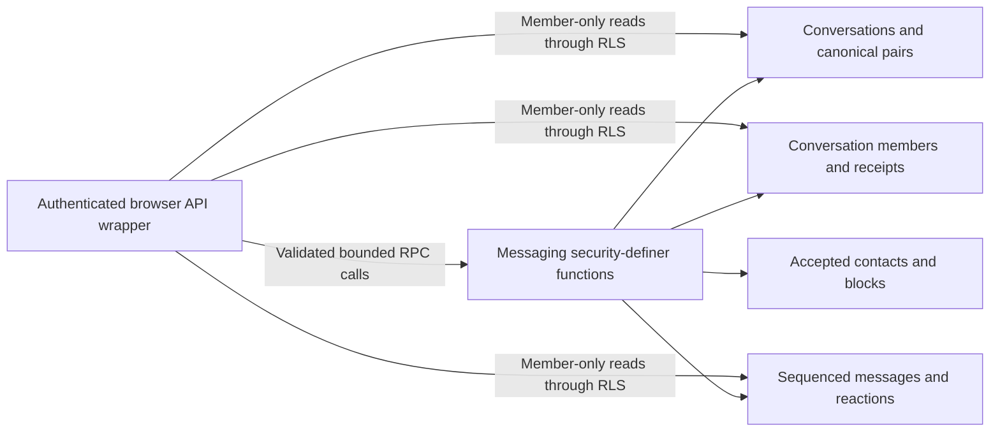

# Architecture

## System context



## Boundaries

The browser is untrusted. It receives only the public Supabase URL and anon key. Authorization
must be enforced by PostgreSQL Row Level Security and server-side functions, never by hidden UI
alone.

Supabase PostgreSQL, Auth, Realtime, Storage, and Edge Functions form Council's trusted server
boundary. Trusted infrastructure can read stored messages and media. Service-role credentials
remain inside this boundary.

OpenRouter and selected model providers are external data processors. Only content explicitly
sent or forwarded to an AI contact may cross this boundary. Application-owned credentials are
used; users do not supply provider keys.

## Planned server components

Future Edge Functions include `ai-chat`, `extract-memory`, `summarize-ai-conversation`,
`create-upload`, `create-media-url`, `process-forwarded-context`, `billing-webhook`,
`export-account`, and `delete-account`. They are architectural expectations, not Milestone 0
implementations.

## Repository architecture

- `apps/web` owns the responsive React application, routes, browser integration, and web tests.
- `packages/schemas` owns environment-neutral Zod schemas shared at runtime boundaries.
- `supabase` owns local service configuration, immutable migrations, pgTAP tests, and future Edge
  Functions.
- `docs` records locked product, architecture, security, and operational decisions.
- `tasks` retains bounded implementation specifications as project history.

The web application uses JavaScript with JSDoc where types clarify boundaries. This keeps the
locked frontend language while ESLint, runtime validation, and tests provide guardrails.
Supabase Edge Functions may use TypeScript because Deno supports it directly and server
boundaries benefit from static checking. Shared schemas remain JavaScript so both environments can
consume them without a compilation step.

## Runtime flow

TanStack Query will manage server state, Zustand manages local UI state, React Router owns
navigation, and the Supabase JavaScript SDK is created from validated browser-safe configuration.

## Account and social database boundary



The authenticated browser may directly select its own profile and settings, update explicitly
granted own-row columns, select visible participant relationships, and select blocks it created.
General stranger discovery is not a table scan: it goes through the bounded
`search_profiles` function and returns a minimal shape.

Cross-user social mutations use narrowly scoped security-definer functions. Those functions
derive the actor from `auth.uid()`, validate target and state, use a fixed
`search_path = public, pg_temp`, and serialize pair mutations with transaction-level advisory
locks. Clients cannot directly insert, update, or delete relationships or blocks.

The private helper schema is not exposed as an API schema. Authenticated users receive only the
schema/function access required for profile RLS; arbitrary-identity block/contact helpers remain
non-executable.

## Web authentication lifecycle



Supabase Auth is the only session source of truth. `AuthProvider` hydrates the existing browser
session, subscribes to Auth events, and exposes session/account states through React context.
Tokens remain inside the Supabase client and are never copied to Zustand, query data, or logs.

TanStack Query owns the current profile and settings. Queries are enabled only for authenticated
users, and profile/settings creation races receive bounded retries because rows are created by
the Auth database trigger. Profile errors remain distinct from signed-out state. Logout removes
all `account` query keys after Supabase completes the session operation.

Guest, onboarding, and protected guards wait for hydration before rendering or redirecting.
Protected redirects carry only an internal route in navigation state. Login passes that value
through a strict internal-path allowlist before navigation.

Presentational components call focused Auth and account API modules rather than using Supabase
directly. Profile changes use `set_my_profile`; preferences use `update_my_settings`, which
merges supported fields without deleting unrelated stored JSON keys.

Password recovery is marked only by Supabase's `PASSWORD_RECOVERY` event. Ordinary authenticated
sessions can reach the same password form only after an explicit security-screen action stored
temporarily in session storage.

## Contacts feature boundary

The contacts experience lives in a focused feature area under
`apps/web/src/features/contacts`: an `api` module of Supabase wrappers, `queries` for query
options and mutation hooks, presentational `components`, `pages`, `hooks`, and pure `utils`.
Presentational components never call Supabase directly; only the `api` wrappers do, and every
wrapper validates returned rows with the shared `@council/schemas` contracts before the data
reaches a component.

All cross-user social writes (sending, responding to, removing, blocking, and unblocking) go
through the existing security-definer database functions. The browser never inserts, updates, or
deletes relationship or block rows. Discovery deliberately avoids direct profile-table
enumeration: it calls the bounded `search_profiles` RPC, which requires at least two characters,
caps results, and applies privacy and block filtering server-side. The blocked-users screen uses
the dedicated `list_my_blocked_users` function because profile RLS hides blocked pairs from each
other.

TanStack Query owns all contacts server state under stable `contacts.*` query keys
(`list`, `requests`, `blocked`, and per-query `search`). Mutations invalidate exactly the buckets
the database contract can change rather than relying on optimistic updates. Only transient form
and dialog state is component-local; no contact data is duplicated into Zustand. A pending
incoming-request count is derived from the shared requests query and shown in navigation.

Supabase Realtime is intentionally deferred to a later milestone. Until then the request count and
lists refresh on tab focus, on normal stale-time expiry, and after successful mutations rather
than through live subscriptions, so a short-lived stale count is expected and acceptable.

## Direct messaging database boundary



Human direct conversations are separated into a general `conversations` row and a
`direct_conversation_pairs` row. The pair stores one sorted UUID tuple, allowing the general
conversation table to support future AI conversation types without pretending those conversations
have two human users. Task 005 implements only the `direct` type.

`create_or_get_direct_conversation` acquires the same transaction-level advisory lock used by
social pair mutations. It rechecks the accepted-contact and block state under that lock, returns
the existing canonical conversation when present, or transactionally inserts the conversation,
pair, and exactly two membership rows. Reciprocal requests therefore converge on one row.

`send_message` uses the conversation row update as the sequence allocation lock. Incrementing
`last_sequence` and returning it in the same statement gives concurrent sends unique monotonic
sequences. A sender/client-message UUID is unique across the sender, and a server-generated hash
of the normalized original payload distinguishes a valid retry from key reuse with changed
conversation, content, or reply target. The hash remains after content deletion so a retry cannot
silently create a replacement message.

Delivered and read state lives on each membership row. Functions lock the conversation, reject
negative or future sequences, and update with `greatest` so delayed events cannot move state
backward. Reading also advances delivery. The sender is automatically advanced through each
successful own send.

Historical reads depend only on conversation membership. Current accepted-contact and block state
is consulted for creation, sending, editing, and adding reactions. Removing a contact or blocking
therefore preserves history but returns one generic unavailable state for new writes. Own-message
deletion and own-reaction removal remain available. Reaccepting the pair resumes the original
conversation.

The web messaging feature currently contains only focused API wrappers, error mapping, shared
schemas, and query-key factories. No inbox, conversation route, composer, or message component is
implemented. Supabase Broadcast/Postgres Changes will attach to persisted message and receipt
events in a later task; the database remains authoritative for reconnect recovery. Private
Storage attachment records and access functions are also deferred. Future AI conversations may
reuse the general conversation boundary but require their own membership/sender authorization
model rather than the direct-human pair table.

## Secure Realtime delivery

Council uses database-originated Supabase Broadcast, not browser-originated Broadcast and not
Postgres Changes. Mutation triggers call `realtime.send` with a custom minimal payload in the same
transaction as the authoritative row change. Failed transactions therefore commit neither state
nor event, and idempotent/no-op RPC paths do not reach event-producing triggers.

Topics are centralized and deterministic:

```text
conversation:{conversation_id}
user:{user_id}:inbox
```

Conversation topics carry message create/edit/delete, reaction, receipt, and generic availability
events. Inbox topics carry conversation create/change and the same generic availability event.
Every payload has version `1`, a UUID transport event ID, event name, timestamp, and only the
applicable conversation/entity/sequence identifiers. Message content, reaction values, profiles,
settings, and social-state causes never enter Broadcast payloads.

Private-channel authorization is evaluated through RLS on `realtime.messages`. Exact conversation
topics require persistent conversation membership, so historical subscribers remain authorized
after contact removal or blocking. Exact inbox topics require the topic UUID to equal
`auth.uid()`. Topic parsing is anchored and fail-closed. Browser roles have no
`realtime.messages` INSERT permission or INSERT policy.

Availability events collapse acceptance, removal, block, and unblock changes into one shape
containing only the conversation ID. `block_user` inserts the block before deleting the accepted
relationship; the relationship trigger detects the block and defers to the block trigger,
preventing duplicate logical events.

### Reconciliation

Realtime is a synchronization hint, never the durable queue. Inbox consumers fetch
`list_my_conversations`, subscribe to their inbox, and refetch affected list state on valid
events. Conversation consumers use this race-safe order:

1. Join the private conversation topic and wait for `SUBSCRIBED`.
2. Fetch the current bounded message page from PostgreSQL.
3. Record the authoritative latest sequence.
4. Process later validated events.
5. Refetch after a sequence gap, event without sequence, reconnect, timeout, channel error,
   browser resume, network restoration, or authentication refresh.

The transport module owns only channels, validation, status normalization, and cleanup. It does
not mutate TanStack Query. A pure event-impact mapping tells later consumers which message,
conversation-list, detail, receipt, or contact areas require invalidation.

The transport `subscribeToPrivateEvents` is synchronous: it creates the channel, registers
handlers, refreshes auth without blocking, and subscribes in one synchronous call, returning the
channel handle immediately. This lets a React effect tear the channel down synchronously on
cleanup, so React StrictMode's mount/unmount/mount cycle in development never leaves two channels
joining the same private topic at once (which would otherwise wedge the subscription).

## Messaging frontend

The human text-messaging UI lives under `apps/web/src/features/messaging` and is wired into the
authenticated shell through two routes:

```text
/app/messages                    inbox (list pane) + placeholder/active conversation
/app/messages/:conversationId    a single direct conversation
```

`MessagingLayout` renders the conversation list in a sidebar and the active conversation through an
`<Outlet/>`. On wide screens both panes show (list | conversation). On narrow screens a single pane
shows at a time, chosen by a `data-view` attribute derived from the route param, giving full-screen
conversation routing on mobile-web. The conversation id is validated as a UUID before any query
runs; an invalid id renders the same generic "unavailable" screen as an inaccessible conversation.

### Query and cache ownership

TanStack Query owns all messaging server state. Stable keys live in `lib/query-keys/messaging.js`:

```text
messaging.conversations()          inbox (infinite query, keyset cursor)
messaging.messages(conversationId) per-conversation history (infinite query, before-sequence cursor)
```

The inbox is keyset-paginated by `(updated_at, id)` exactly as `list_my_conversations` returns it;
ordering is never recomputed locally from event arrival. Message history loads the newest page
first and pages older windows with an exclusive `before_sequence` cursor; pages are flattened,
de-duplicated by id, and sorted ascending for rendering. Cache mutations are centralized in
`queries/messageCache.js` (upsert/replace a message in place, clear deleted content) and
`queries/conversationCache.js` (patch the caller's own receipt fields to clear the unread badge
without a refetch). All messaging queries are dropped on sign-out via `queryClient.clear()`.

### Optimistic send and reconciliation

`useSendMessage` owns optimistic outgoing state per conversation — never the message query cache.
Each send generates a client UUID used as the backend idempotency key. On success the authoritative
row is written into the message cache and the optimistic placeholder is removed, so the realtime
echo and any refetch converge to exactly one message (de-duplicated by id). A failed send stays
visible with retry/remove controls; retry reuses the same client id and payload, which the backend
treats idempotently. Optimistic messages are never marked delivered or read.

### Realtime lifecycle and gap recovery

`useInboxRealtime` runs at the authenticated shell level: it subscribes to the user inbox topic and,
on any validated event, invalidates the conversation list (and, for availability changes, the
affected conversation's messages and the contact list). `useConversationRealtime` subscribes to the
active conversation topic. Message create/edit/delete and reaction events trigger targeted
invalidation of that conversation's message query; receipt events from the peer update outgoing
receipt state; availability events refresh the inbox and contacts without inferring a cause.
Sequence gaps are assessed with the Task 006 reconciliation helper, and the message window is
refetched on (re)subscribe, on focus/visibility resume, and after any gap — so messages missed
while offline are reconciled from the database on reconnect. Malformed events are dropped by the
transport layer before reaching UI state, and event payloads are never logged.

### Receipt behavior

`useConversationReceipts` advances the caller's own delivered/read receipts monotonically and
debounced: delivered advances whenever an open conversation has reconciled messages; read advances
only while the conversation is active and the document is visible. The peer's read/delivered
sequences are learned from realtime receipt events, so the newest outgoing message shows an honest
single indicator — Sent until a receipt is observed, then Delivered, then Read — rather than a
fabricated per-message status.
